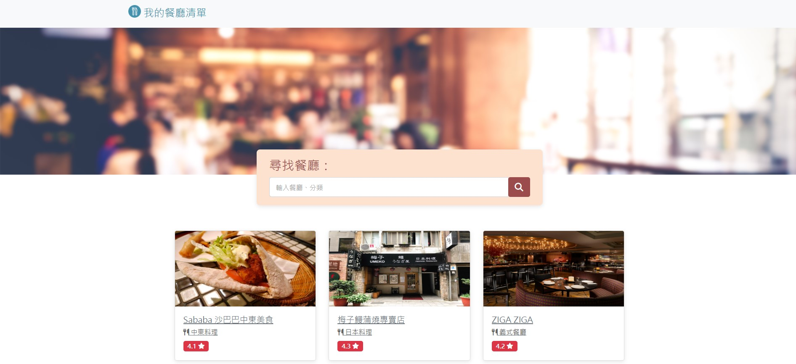

# 餐廳清單 1.0




## 介紹

紀錄屬於自己的餐廳清單，可以瀏覽餐廳、查看詳細資訊、搜尋餐廳或類別以及連結到 Google 地圖。

## 功能

- 瀏覽所有餐廳
- 查看餐廳的詳細資訊
- 連結餐廳的地址至 Google 地圖
- 搜尋特定餐廳或類別

## 開始使用

1. 請先確認有安裝 node.js 與 npm
2. 開啟終端機，到欲存放專案的路徑下，將專案 clone 到本地，輸入：

   ```bash
   git clone https://github.com/WinstonAdams/Restaurant-List.git
   ```
   
3. 安裝相關套件，輸入：

   ```bash
   npm install
   ```

4. 執行專案，輸入：

   ```bash
   npm run dev
   ```

5. 在終端機看見此行訊息代表順利執行

   ```bash
   Listening on http://localhost:3000
   ```
   
6. 打開瀏覽器輸入以下網址

   ```bash
   http://localhost:3000
   ```
   


## 開發工具

- Node.js - 執行環境
- Express - Web 應用程式框架
- Express-Handlebars - 樣板引擎
- Bootstrap - 前端框架
- Font-awesome - 字體和圖標工具套件
