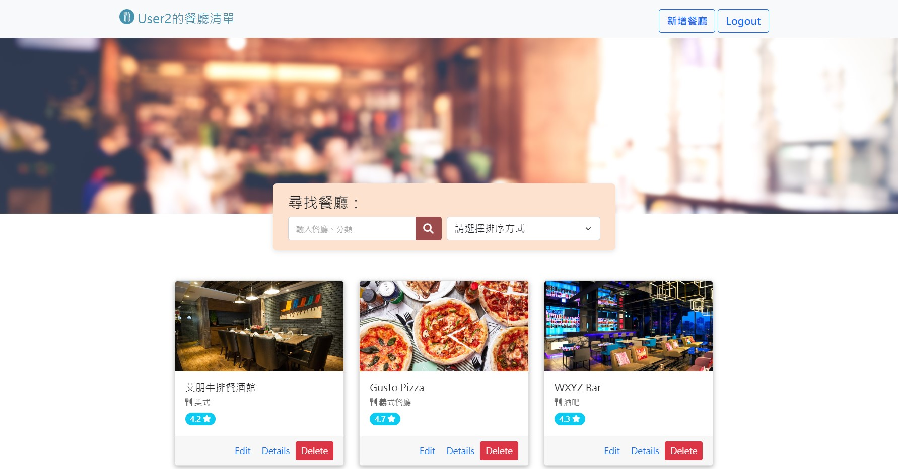
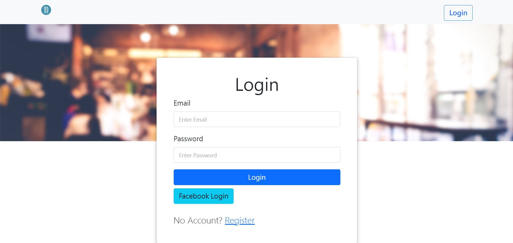
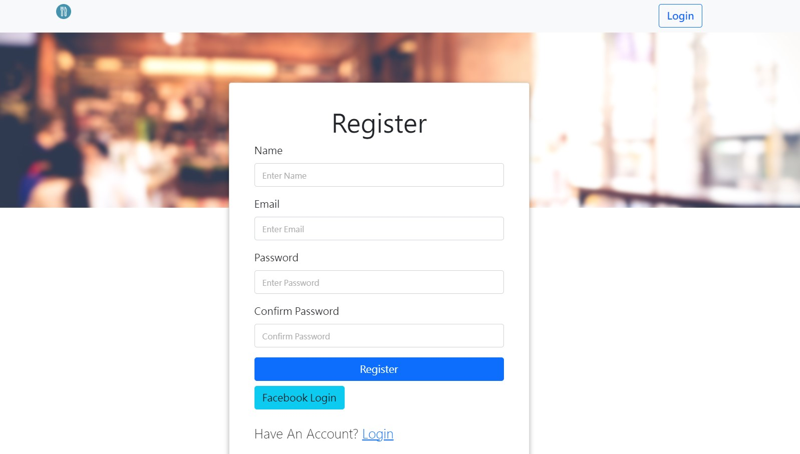

# 餐廳清單 3.0





## 介紹

紀錄屬於自己的餐廳清單，可以瀏覽餐廳、查看詳細資訊、搜尋餐廳或類別以及連結到 Google 地圖。

## 功能

- 瀏覽所有餐廳
- 查看餐廳的詳細資訊
- 新增餐廳
- 修改餐廳的資訊
- 刪除餐廳
- 連結餐廳的地址至 Google 地圖
- 搜尋特定餐廳或類別
- 使用者可以用 email 或 Facebok 註冊與登入
- 使用者可以建立並管理專屬的餐廳清單

## 開始使用

1. 請先確認有安裝 Node.js 與 npm
2. 開啟終端機，到欲存放專案的路徑下，將專案 clone 到本地，輸入：

   ```bash
   git clone https://github.com/WinstonAdams/Restaurant-List.git
   ```
   
3. 安裝相關套件，輸入：

   ```bash
   npm install
   ```
   
4. 安裝 nodemon 

   ```bash
   npm i -g nodemon
   ```

5. 根據 .env.example 設定環境變數，新增 .env 檔案，檔案中輸入：

   ```bash
   PORT = 3000
   SESSION_SECRET = 'ThisIsMySecret'
   MONGODB_URI = <Your own MongoDB connection URL>
   FACEBOOK_ID = <Facebook 應用程式編號>
   FACEBOOK_SECRET = <Facebook 應用程式密鑰>
   FACEBOOK_CALLBACK = "http://localhost:3000/auth/facebook/callback"
   ```
   
6. 載入種子資料，輸入：

   ```bash
   npm run seed
   ```

7. 在終端機看見以下訊息代表順利執行
   
   ```bash
   mongodb connected!
   done!
   ```
   
8. 執行專案，輸入：

   ```bash
   npm run dev
   ```

9. 在終端機看見以下訊息代表順利執行

   ```bash
   App is listening on http://localhost:3000
   mongodb connected!
   ```
   
10. 打開瀏覽器輸入以下網址

    ```bash
    http://localhost:3000
    ```

11. 終止伺服器
    
    ```bash
    ctrl + c
    ```

    
測試帳號

   >- name: user1
   >- email: <user1@example.com>
   >- password: 12345678
   
   >- name: user2
   >- email: <user2@example.com>
   >- password: 12345678


## 開發工具

- Node.js - 執行環境
- Express - Web 應用程式框架
- Express-Handlebars - 樣板引擎
- Bootstrap - 前端框架
- Font-awesome - 字體和圖標工具套件
